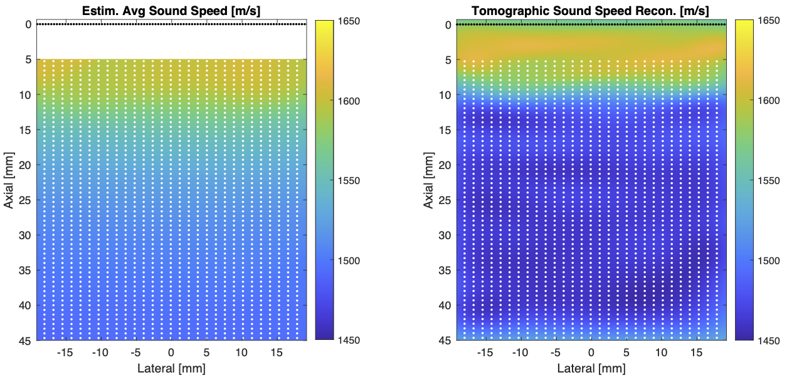
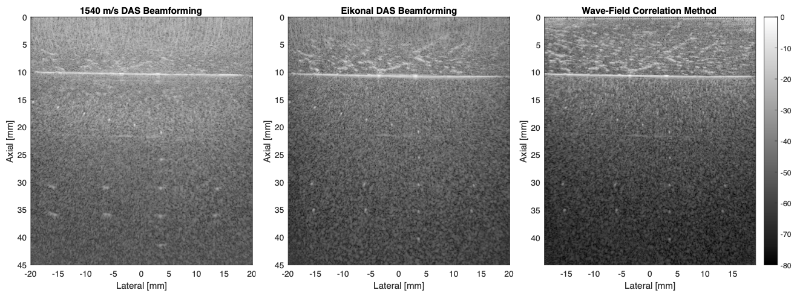

# DistributedAberrationCorrection
Distributed Aberration Correction Techniques Based on Tomographic Sound Speed Estimates

Phase aberration correction is the process of applying delay/phase correction to ultrasound signals after applying focusing delays (based on an assumed speed of sound: usually 1540 m/s) to ultrasound channel data prior to summation in a delay-and-sum (DAS) beamformer. Although phase aberration correction is typically caused by sound speed heterogeneities in the medium, the aberration delays/phases are typically modeled independently for each imaging point without reference to the spatial distribution of sound speed in the medium. Here, we show (1) a tomographic sound speed estimator based on phase aberrations after focusing and (2) two different distributed aberration correction techniques that use a tomographic sound speed estimate to create optimally-focused ultrasound images:
* The first distributed aberration correction technique achieves distributed aberration correction by modeling the times-of-flight (TOF) between transducer elements and imaging points by solving the eikonal equation. The eikonal equation which relates the speed of sound in the medium (from our tomographic estimator) and the TOF between transducer elements and imaging points. These TOF are used as delays in a DAS beamformer.
* The second distributed aberration correction technique is based on the cross-correlation of transmitted and received wave-fields (see https://github.com/rehmanali1994/FourierDomainBeamformer). This technique models transmitted and receive wave-fields in a heterogeneous sound speed medium by applying the Fourier split-step form of the angular spectrum method. By modeling these wave-fields in a heterogeneous medium, the cross-correlation of transmitted and received wavefields should yield an optimally focused ultrasound image. Note that this imaging approach does not fall under a standard DAS beamforming typically applied in ultrasound imaging.

We provide sample data and algorithms presented in

> Ali, R.; Hyun, D.; Brickson, L.; Dahl, J. "Distributed Aberration Correction Techniques Based on Tomographic Sound Speed Estimates". *Manuscript submitted for publication.*

for the tomographic sound speed estimation technique and the two distributed aberration correction techniques described above. If you use the code/algorithm for research, please cite the above paper.

You can reference a static version of this code by its DOI number: (COMING SOON)

# Code and Sample Datasets

The sound speed estimator can be broken into two two steps:
1) Generation of coherence factor (CF) images at various focusing speeds of sound from which average sound speed may be estimated: [CoherenceFactorImages.m](CoherenceFactorImages.m) reads the channel data from (ChickenPhantomMultiFocal.mat), creates the stack of CF images, and saves the CF image stack in (SavedCoherenceFactorImages.mat).
2) Tomographic sound speed estimator: [SoundSpeedEstimation.m](SoundSpeedEstimation.m) estimates the average speed of sound from the CF image stack in (SavedCoherenceFactorImages.mat), reconstructions the speed of sound using travel-time tomography, and save the reconstructed speed of sound to (SoundSpeedEstimate.mat). *During the process we save a sparse matrix in (tomography_matrix.mat) that relates the pixels in the reconstruction to the travel times projected by the average sound speed estimates.*

The resulting sound speed estimates in (SoundSpeedEstimate.mat) are used by the two distributed aberration correction algorithms to reconstruct an optimally focused ultrasound image from the channel data in (ChickenPhantomMultiFocal.mat):
1) Eikonal-Corrected DAS Beamforming [EikonalReconFromFullSynthData.m](EikonalReconFromFullSynthData.m) 
2) Wave-Field Correlation Method [FreqDomShotGatherMig.m](FreqDomShotGatherMig.m)

Please see any supporting functions in the following directories for sound speed estimation [sound_speed_estim_functions](sound_speed_estim_functions), DAS beamforming [beamforming_functions](beamforming_functions), ray tracing via the eikonal equation [ray_tracing_functions](ray_tracing_functions), and the wave-field correlation method [angular_spectrum_functions](angular_spectrum_functions).

**Please download the sample data (ChickenPhantomMultiFocal.mat) and the following intermediate saved files [(SavedCoherenceFactorImages.mat), (tomography_matrix.mat), and (SoundSpeedEstimate.mat)] under the [releases](https://github.com/rehmanali1994/DistributedAberrationCorrection/releases) tab for this repository, and place that data in the main directory ([FourierDomainBeamformer](https://github.com/rehmanali1994/DistributedAberrationCorrection)).**

# Sample results
Here is a tomographic reconstruction of the speed of sound in the medium (the white dots shown here represent the observation points used in the tomographic reconstruction):

Below we show image reconstruction with (Left) a conventional 1540 m/s DAS beamformer and aberration correction based on the eikonal equation (Middle) and wave-field correlation (Right) techniques:

